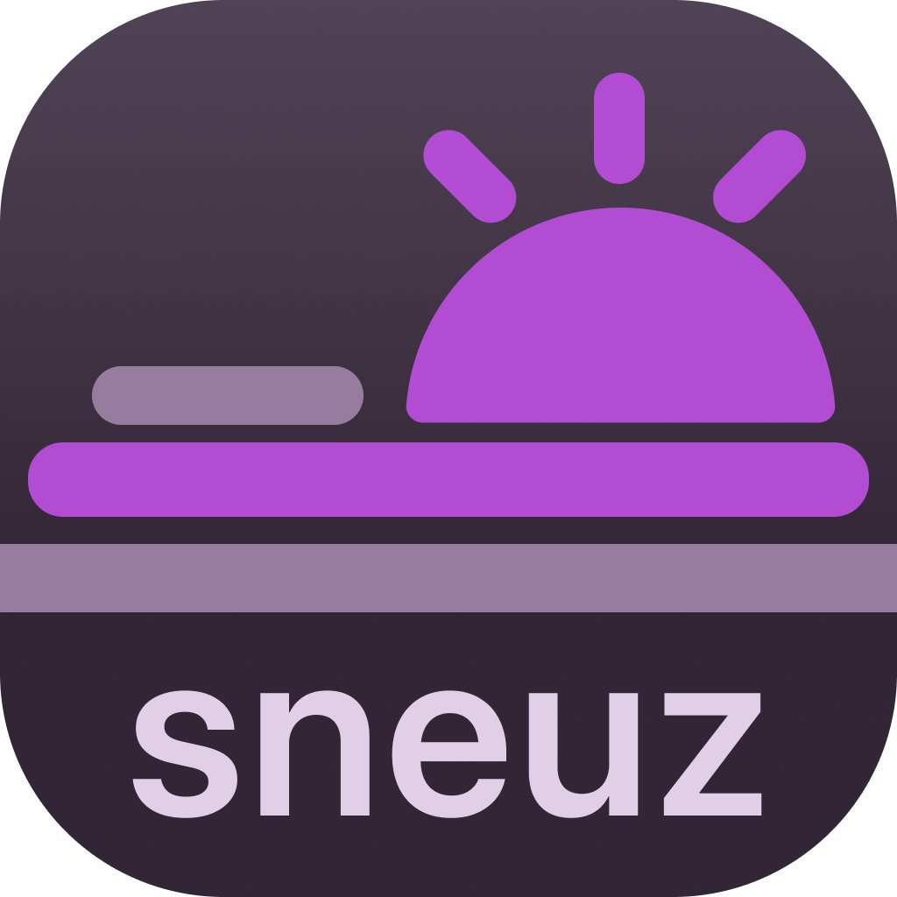

<div align="center">



Apple removed iPhone auto sleep tracking. We brought it back, with extras.

</div>

---

## What it does

iOS 18 removed automatic sleep tracking on iPhone.

Sneuz brings it back with Shortcuts automation: track sleep/wake times, view sleep patterns on iPhone or web, and export data to Apple Health at any time.

Set it up once, runs automatically.

Watch the demo below:

## Features

- **Shortcuts automation**: Hooks into Sleep Focus mode - tracking starts/stops automatically
- **Home screen widget**: Glanceable status and quick actions without opening the app
- **Web calendar view**: Visualize sleep patterns on a proper calendar
- **Apple Health export**: One-click sync to Apple Health
- **Cross-platform sync**: iOS and web stay in sync via Supabase

## Tech Stack

- **iOS**: Swift, SwiftUI, WidgetKit, HealthKit, App Intents
- **Web**: Next.js, Tailwind, Supabase SSR
- **Backend**: Supabase (Postgres + Auth + RLS)

## iOS App Status

Fully built. Can verify and tested out via Xcode & simulator.

It _might_ be shipped on App Store.

## Dev Setup

**Prerequisites**: Xcode, Node.js, Supabase account

**Backend**:

- Create Supabase project
- Run migrations from `supabase/migrations` in order
- Enable email/password auth

**Web**:

```bash
cp .env.example web/.env  # add your Supabase credentials
cd web
npm install && npm run dev
```

**iOS**:

1. Open `ios/Sneuz.xcodeproj`
2. Update `Config.swift` with Supabase URL + anon key
3. Set App Group to `group.io.sneuz.shared` in Signing & Capabilities
4. Run on simulator or install on physical device (need to plug in using cable)
5. Enjoy

## How Shortcuts automation works

App Intents framework exposes `StartTrackingIntent` and `StopTrackingIntent` to iOS.

Users create automations tied to Focus modes (Sleep Focus or any other focus modes). When triggered: validates state → writes to Supabase → refreshes widget.

See [this doc](docs/ios-automation.md) for more details. Sleep Focus is weird, and it has special toggle behavior.

Zero background tasks. Just two API calls when Focus toggles - minimal battery impact.

## License

MIT
