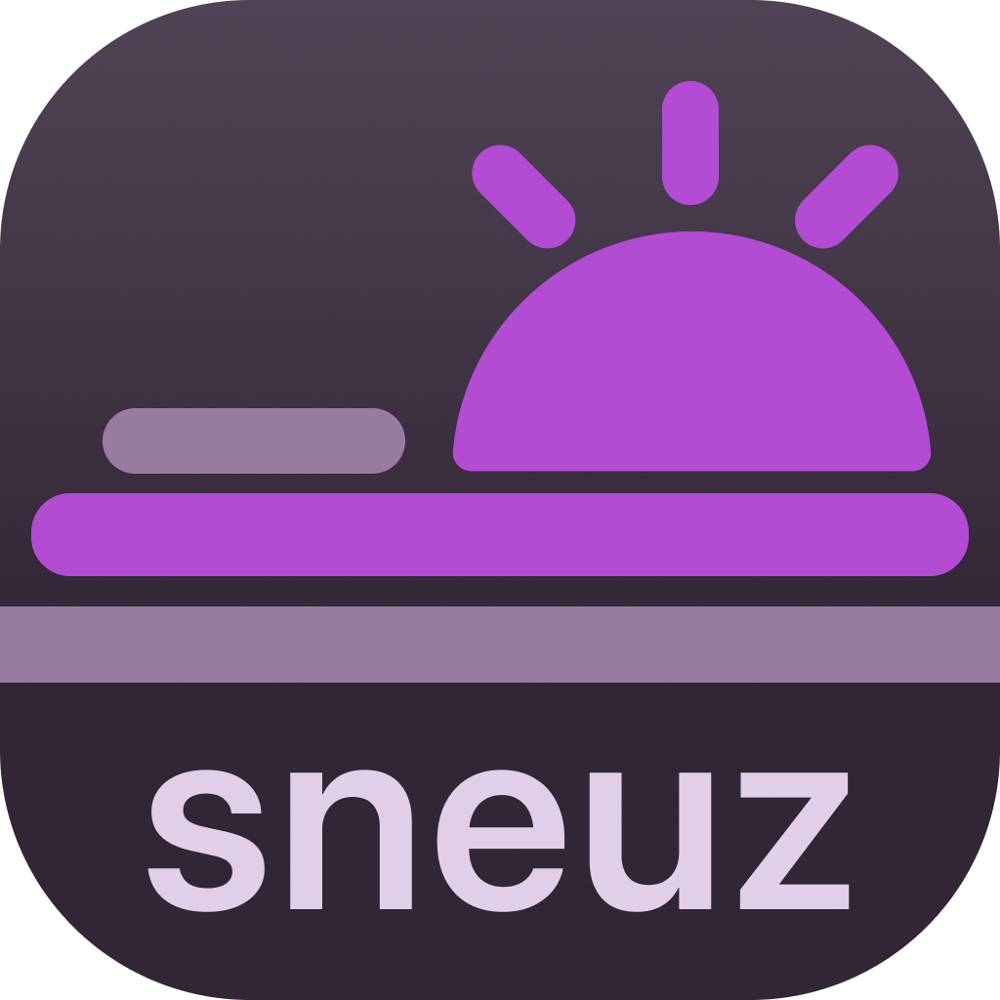

<div align="center">



Apple removed iPhone auto sleep tracking. We brought it back, with extras.

</div>

---

## What it does

iOS 18 removed automatic sleep tracking on iPhone.

Sneuz brings it back with Shortcuts automation: track sleep/wake times, view sleep patterns on iPhone or web, and export data to Apple Health at any time.

Set it up once, runs automatically.

https://github.com/user-attachments/assets/3fc11cd6-3557-4489-a276-d984c3a937e5

https://github.com/user-attachments/assets/71894cbb-5b23-4540-b664-8e7bacce0669

## Features

- **Shortcuts automation**: Hooks into Sleep Focus mode - tracking starts/stops automatically
- **Home screen widget**: Glanceable status and quick actions without opening the app
- **Web calendar view**: Visualize sleep patterns on a proper calendar
- **Apple Health export**: One-click sync to Apple Health
- **Cross-platform sync**: iOS and web stay in sync via Supabase

## Tech Stack

- **iOS**: Swift, SwiftUI, WidgetKit, HealthKit, App Intents
- **Web**: Next.js, Tailwind, Supabase SSR
- **Backend**: Supabase (Postgres + Auth + RLS)

## iOS App Status

Fully built. Can verify and tested out via Xcode & simulator.

It _might_ be shipped on App Store.

## Dev Setup

**Prerequisites**: Xcode, Node.js, pnpm, Supabase account

There is no local-only mode. The web app and the iOS app both talk to a real Supabase project, so you need your own before anything runs. Budget ~15 minutes for the backend step.

**Backend**:

- Create Supabase project
- Run migrations from `supabase/migrations` in order
- Enable email/password auth
- Add `http://localhost:3000/**` under Authentication > URL Configuration > Redirect URLs

**Web**:

```bash
cp web/.env.example web/.env  # add your Supabase credentials
cd web
pnpm install && pnpm dev
```

`pnpm validate` runs build, lint, tests, and react-doctor.

**iOS**:

1. Open `ios/Sneuz.xcodeproj`
2. Update `Config.swift` with Supabase URL + anon key
3. Set App Group to `group.io.sneuz.shared` in Signing & Capabilities
4. Run on simulator or install on physical device (need to plug in using cable)
5. Enjoy

## How Shortcuts automation works

App Intents framework exposes `StartTrackingIntent` and `StopTrackingIntent` to iOS.

Users create automations tied to Focus modes (Sleep Focus or any other focus modes). When triggered: validates state → writes to Supabase → refreshes widget.

See [this doc](docs/ios-automation.md) for more details. Sleep Focus is weird, and it has special toggle behavior.

Zero background tasks. Just two API calls when Focus toggles - minimal battery impact.

## API

The web app exposes a REST API at `/api/v1` for external services (e.g. home servers, automations).

### authentication

All endpoints require an `Authorization` header. Two schemes are supported:

```
Authorization: Bearer <supabase-jwt>
Authorization: ApiKey <snz_key>
```

API keys (`snz_` prefix) are the recommended approach for long-lived external integrations. Generate one in the web app under Settings > API Keys.

### endpoints

#### sessions

| method   | path                   | description         |
| -------- | ---------------------- | ------------------- |
| `GET`    | `/api/v1/sessions`     | list sleep sessions |
| `POST`   | `/api/v1/sessions`     | create a session    |
| `PATCH`  | `/api/v1/sessions/:id` | update a session    |
| `DELETE` | `/api/v1/sessions/:id` | delete a session    |

**GET** query params: `limit` (default 50, max 200), `offset`, `from` (ISO date), `to` (ISO date)

**POST / PATCH** body:

```json
{ "bedtime": "2026-01-01T23:00:00Z", "wake_time": "2026-01-02T07:00:00Z" }
```

`bedtime` is required on POST. PATCH requires at least one field.

**session object:**

```json
{
  "id": "uuid",
  "bedtime": "2026-01-01T23:00:00Z",
  "wake_time": "2026-01-02T07:00:00Z",
  "duration_minutes": 480,
  "created_at": "2026-01-01T23:00:00Z"
}
```

#### profile

| method | path              | description      |
| ------ | ----------------- | ---------------- |
| `GET`  | `/api/v1/profile` | get user profile |

```json
{
  "id": "uuid",
  "email": "user@example.com",
  "full_name": "Jane",
  "avatar_url": ""
}
```

#### settings

| method  | path               | description          |
| ------- | ------------------ | -------------------- |
| `GET`   | `/api/v1/settings` | get sleep targets    |
| `PATCH` | `/api/v1/settings` | update sleep targets |

**PATCH** body (at least one field required):

```json
{ "target_bedtime": "23:00", "target_wake_time": "07:00" }
```

#### api keys

| method   | path               | description       |
| -------- | ------------------ | ----------------- |
| `GET`    | `/api/v1/keys`     | list api keys     |
| `POST`   | `/api/v1/keys`     | create an api key |
| `DELETE` | `/api/v1/keys/:id` | revoke an api key |

**POST** body: `{ "name": "home server" }`

The raw key is only returned once in the POST response. Store it securely.

### example

```bash
curl https://sneuz.rickytang.dev/api/v1/sessions \
  -H "Authorization: ApiKey snz_your_key_here"
```

## License

MIT
